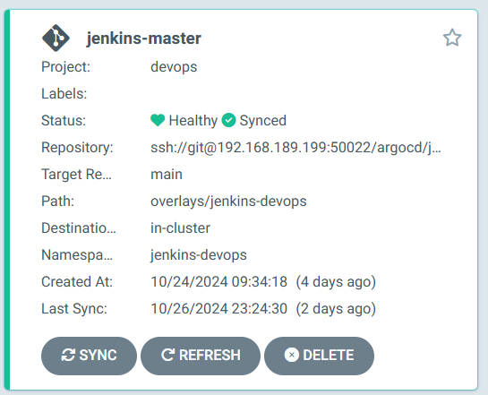
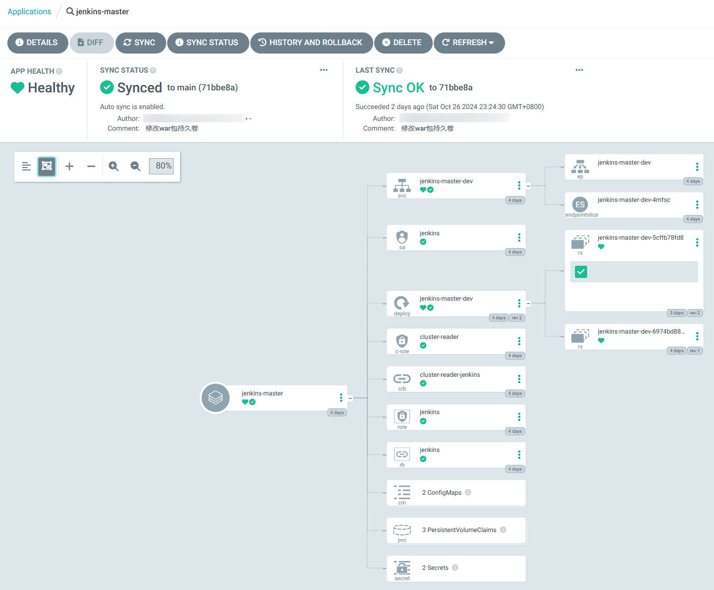

# jenkins-deploy

用于在k8s上部署Jenkins-master

## argocd 部署Jenkins-master

```bash
ubuntu@k8s-master01:~$ argocd app get jenkins-master
Name:               argocd/jenkins-master
Project:            devops
Server:             https://kubernetes.default.svc
Namespace:          jenkins-devops
URL:                https://192.168.189.200:31642/applications/jenkins-master
Source:
- Repo:             ssh://git@192.168.31.199:50022/argocd/jenkins-deploy.git
  Target:           main
  Path:             overlays/jenkins-devops
SyncWindow:         Sync Allowed
Sync Policy:        Automated
Sync Status:        Synced to main (71bbe8a)
Health Status:      Healthy

GROUP                      KIND                   NAMESPACE       NAME                          STATUS   HEALTH   HOOK  MESSAGE
                           ServiceAccount         jenkins-devops  jenkins                       Synced                  serviceaccount/jenkins unchanged
                           Secret                 jenkins-devops  harbor-inner                  Synced                  secret/harbor-inner unchanged
                           Secret                 jenkins-devops  harbor-aliyun                 Synced                  secret/harbor-aliyun unchanged
                           ConfigMap              jenkins-devops  buildkitd-configmap           Synced                  configmap/buildkitd-configmap unchanged
                           ConfigMap              jenkins-devops  nerdctl-configmap             Synced                  configmap/nerdctl-configmap unchanged
                           PersistentVolumeClaim  jenkins-devops  jenkins-master-workspace-dev  Synced   Healthy        persistentvolumeclaim/jenkins-master-workspace-dev unchanged
                           PersistentVolumeClaim  jenkins-devops  jenkins-agent-workspace-dev   Synced   Healthy        persistentvolumeclaim/jenkins-agent-workspace-dev unchanged
                           PersistentVolumeClaim  jenkins-devops  jenkins-war-dev               Synced   Healthy        persistentvolumeclaim/jenkins-war-dev unchanged
rbac.authorization.k8s.io  ClusterRole            jenkins-devops  cluster-reader                Running  Synced         clusterrole.rbac.authorization.k8s.io/cluster-reader reconciled. clusterrole.rbac.authorization.k8s.io/cluster-reader unchanged
rbac.authorization.k8s.io  ClusterRoleBinding     jenkins-devops  cluster-reader-jenkins        Running  Synced         clusterrolebinding.rbac.authorization.k8s.io/cluster-reader-jenkins reconciled. clusterrolebinding.rbac.authorization.k8s.io/cluster-reader-jenkins unchanged
rbac.authorization.k8s.io  Role                   jenkins-devops  jenkins                       Synced                  role.rbac.authorization.k8s.io/jenkins reconciled. role.rbac.authorization.k8s.io/jenkins unchanged
rbac.authorization.k8s.io  RoleBinding            jenkins-devops  jenkins                       Synced                  rolebinding.rbac.authorization.k8s.io/jenkins reconciled.rolebinding.rbac.authorization.k8s.io/jenkins unchanged
                           Service                jenkins-devops  jenkins-master-dev            Synced   Healthy        service/jenkins-master-dev unchanged
apps                       Deployment             jenkins-devops  jenkins-master-dev            Synced   Healthy        deployment.apps/jenkins-master-dev configured
rbac.authorization.k8s.io  ClusterRole                            cluster-reader                Synced
rbac.authorization.k8s.io  ClusterRoleBinding                     cluster-reader-jenkins        Synced
```



