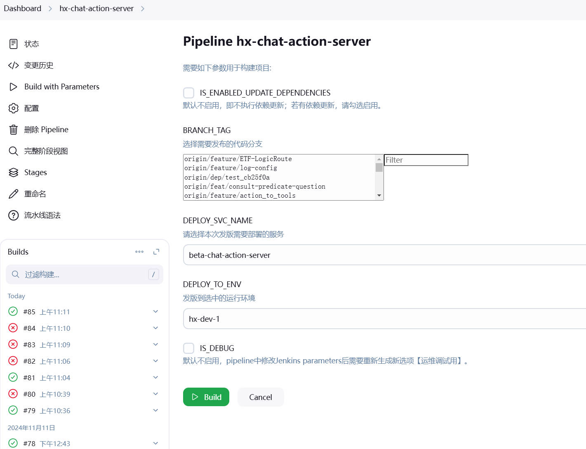

# jenkins-pipeline


```bash
docker run --rm \
    -v /root/.docker/config.json:/root/.docker/config.json \
    harbor.mydomain.com/libs/skopeo/stable:latest \
    copy --insecure-policy --src-tls-verify=false --dest-tls-verify=false \
    --dest-authfile /root/.docker/config.json \
    --src-authfile /root/.docker/config.json \
    docker://fb-harbor.betack.com:8765/libs/python:bf-v3.10.14-bookworm \
    docker://iamIPaddr:11180/libs/python:bf-v3.10.14-bookworm
```

## pipeline


